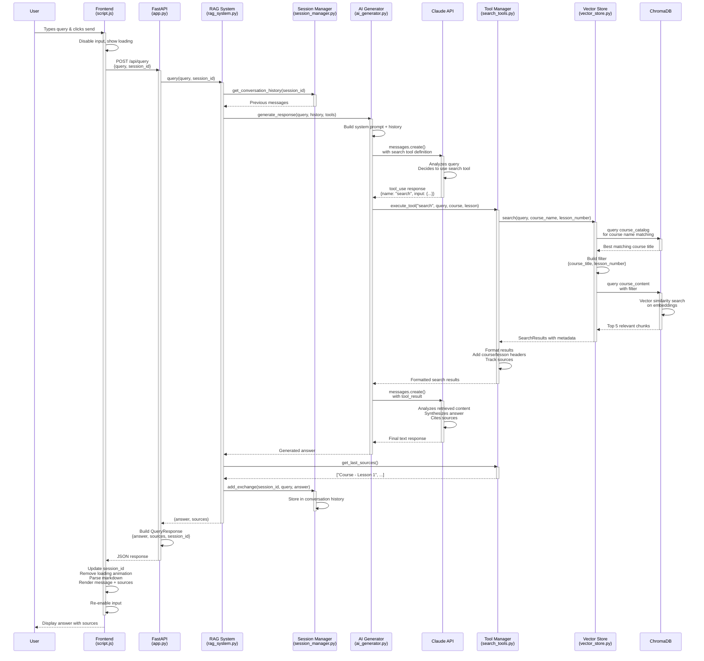

# RAG Chatbot Query Flow Diagram

## Complete User Query Flow



## Architecture Components

### Frontend Layer
- **index.html**: UI structure with chat interface
- **script.js**: Event handling, API calls, message rendering
- **Technologies**: Vanilla JavaScript, Marked.js for markdown

### Backend API Layer
- **app.py**: FastAPI endpoints, request/response models
- **Entry point**: POST `/api/query`

### RAG Orchestration Layer
- **rag_system.py**: Main orchestrator
- **session_manager.py**: Conversation history management
- **ai_generator.py**: Claude API integration

### Tool & Search Layer
- **search_tools.py**: Tool definitions and execution
- **vector_store.py**: Vector search interface
- **ChromaDB**: Vector database with embeddings

### Document Processing Layer
- **document_processor.py**: Text chunking, metadata extraction
- **models.py**: Data models (Course, Lesson, Chunk)

## Key Data Flows

### Request Format
```json
{
  "query": "What is taught in lesson 2 of the MCP course?",
  "session_id": "session_abc123"
}
```

### Tool Call Format (Claude → Backend)
```json
{
  "name": "search",
  "input": {
    "query": "lesson 2 MCP course content",
    "course_name": "MCP",
    "lesson_number": 2
  }
}
```

### Tool Result Format (Backend → Claude)
```
[Building with MCP - Lesson 2]
Lesson 2 content: In this lesson, you'll learn about...

[Building with MCP - Lesson 2]
Course Building with MCP Lesson 2 content: The key concepts include...
```

### Response Format
```json
{
  "answer": "In lesson 2 of the Building with MCP course...",
  "sources": [
    "Building with MCP - Lesson 2"
  ],
  "session_id": "session_abc123"
}
```

## System Characteristics

### 🎯 Agentic RAG Pattern
- Claude autonomously decides when to search
- Not all queries trigger retrieval
- Tool-based retrieval instead of forced retrieval

### 💬 Stateful Conversations
- Server-side session management
- Conversation history included in each Claude call
- Enables follow-up questions and context awareness

### 🔍 Two-Stage Search
1. **Course Resolution**: Semantic search on course catalog
2. **Content Search**: Filtered vector search on course content

### ⚡ Performance Optimizations
- Single search per query (tool use limit)
- ChromaDB persistent storage (no re-embedding)
- Efficient chunking with overlaps (800 chars, 100 overlap)

### 🏗️ Dual Collection Architecture
- **course_catalog**: High-level course metadata for name matching
- **course_content**: Chunked course material for content retrieval
